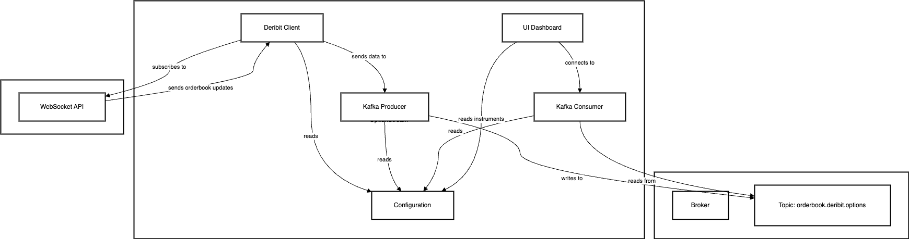
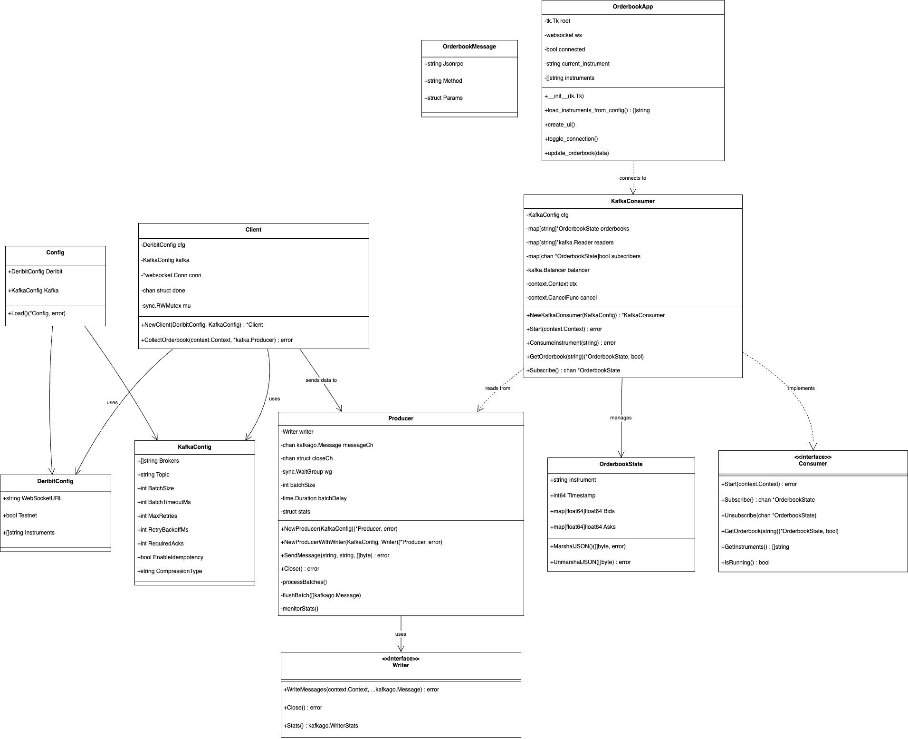
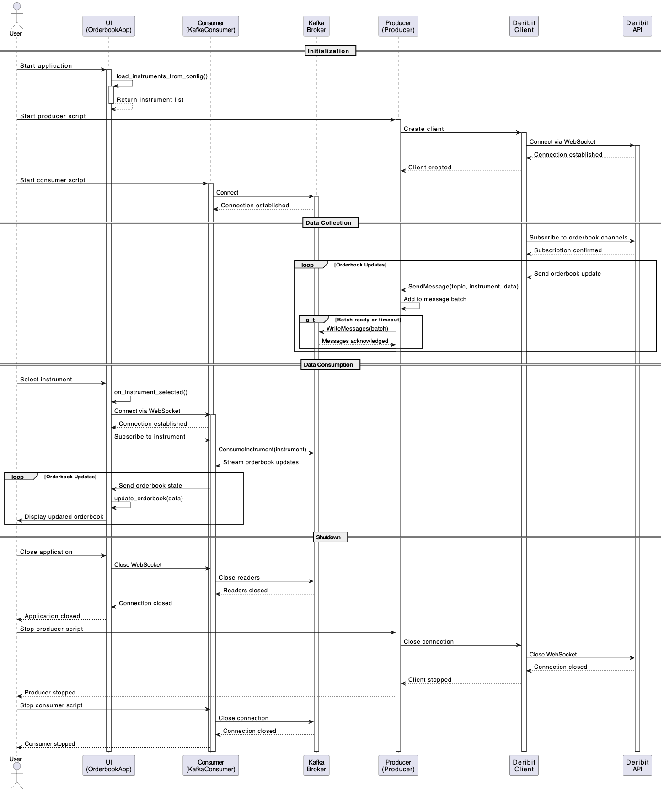

# OptionStream

A high-performance system for collecting and streaming BTC/USD options order book data from Deribit to Kafka. This system is designed for both real-time market making and historical data analysis.

## Features

- **Real-time Order Book Data Collection**
  - Subscribes to multiple BTC/USD options instruments
  - Efficient WebSocket connection management
  - Automatic reconnection and heartbeat mechanism
  - Configurable instrument list

- **High-Performance Kafka Integration**
  - Optimized for high throughput and low latency
  - Batch processing with configurable size and timeout
  - Message compression (Snappy)
  - Idempotency guarantees
  - Automatic retry mechanism
  - Detailed monitoring and statistics

- **Robust Error Handling**
  - Automatic reconnection for network issues
  - Graceful error recovery
  - Comprehensive error logging
  - Performance monitoring

## Prerequisites

- Go 1.21 or later
- Docker and Docker Compose
- Kafka cluster (can be run locally using Docker)

## Project Structure

```
.
├── cmd/
│   └── orderbook/          # Main application entry point
├── config/
│   └── config.yaml         # Configuration file
├── internal/
│   ├── config/            # Configuration management
│   ├── deribit/           # Deribit WebSocket client
│   └── kafka/             # Kafka producer implementation
├── frontend/
│   ├── main.py           # simple ui to watch the orderbook update
├── docker-compose.yml      # Docker services configuration
├── Makefile              # Build and management commands
└── README.md
```

## UML Diagrams

### Component Architecture


### Class Diagram 


### Sequence Diagram


## Configuration

The system is configured through `config/config.yaml`:

```yaml
deribit:
  websocket_url: "wss://test.deribit.com/ws/api/v2"
  testnet: true
  instruments:
    - "BTC-30MAR25-70000-C"
    - "BTC-30MAR25-70000-P"
    # ... more instruments

kafka:
  brokers:
    - "127.0.0.1:9092"
  topic: "orderbook.deribit.options"
  batch_size: 100
  batch_timeout_ms: 100
  max_retries: 3
  retry_backoff_ms: 100
  required_acks: -1
  enable_idempotency: true
  compression_type: "snappy"
```

## Quick Start
For a quick setup, use the provided scripts:

Run the producer (collects data from Deribit and sends to Kafka):

``` ./start_producer.sh```

Open a new terminal tab to run the consumer (processes Kafka messages):
```  ./start_consumer.sh```

If you want to visualize the orderbook updates in real-time:

```./start_ui.sh```
The UI will allow you to select different instruments and view their order books in real-time.

You can also monitor Kafka topics and messages through the Kafka UI at:
```
http://localhost:8080/ui/clusters/local/all-topics?perPage=25
```


## Design Considerations & Thought Process
1. Batching Strategy: Rather than sending individual updates to Kafka, messages are batched by time (100ms default) or size (100 messages default). This significantly reduces network overhead while maintaining near real-time delivery.
2. Message Compression: Snappy compression reduces bandwidth usage by approximately 60-70% with minimal CPU overhead.

## Robust error handling is critical for a system that interfaces with external APIs:

1. Auto-Reconnection: The WebSocket client automatically attempts to reconnect with exponential backoff on connection failures.
2. Graceful Degradation: If specific instruments become unavailable, the system continues collecting data for others.
3. Comprehensive Logging: All errors are logged with context for debugging, including timestamps and request details.


## Future Enhancements
1. instrument auto-discovery
2. better auto recover/ reconnect 